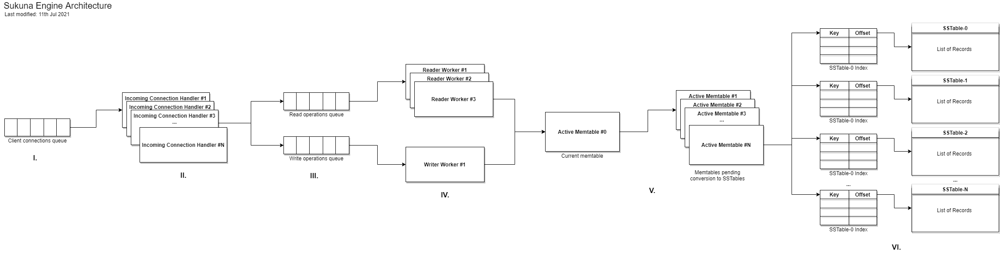

# Sukuna Design

This directory contains documents to describe the design and architecture of Sukuna.

**Last Updated**: 11th Jul 2021

## Introduction

At the core of Sukuna, is the module `sukuna-engine`. It is host agnostic log based (SSTable) disk backed key-value database engine. `sukuna-engine` is written in Java and can be embedded into any Java application, meaning Sukuna does not necessarily force "how" the storage engine is hosted and made available to clients. Having said that, there is default TCP based CLI version of the engine which can be found in the module `sukuna-service`. Users can interact with this service using the default TCP based CLI client which can be found in the `sukuna-cli-client` module.

The documentation covers only the the `sukuna-engine` module since that is the host agnostic storage engine. Going forward, the term "engine" will be used to mean "`sukuna-engine`" for simplicity.

## Architecture

This section gives a brief overview of the high level architecture of the engine. The low level entities that abstract a lot of the operations described here can be found in the entity documentation.

The current architecture of the engine is as follows (click on the image to see it in the original resolution):

### I. Client Connection Queue

The client connection queue is where incoming client connection requests are queued. A client connection is an abstract entity in the engine, it can be a TCP connection (i.e., a TCP socket) or a Java object. The engine pops client connections from this queue to decide what to do with them.

### II. Incoming Connection Handler Threads

The incoming connection handler threads are responsible for handling an incoming client connection - determine what kind of command the client wants the engine to process and then create an appropriate operation for that (read or write are currently the valid operations supported).

### III. Read & Write Operation Queues

Once a client connection was handled by an incoming connection handler thread, it gets converted to an operation - either a read operation or a write operation. To be able to handle these operations, there are two queues in the engine for either type of operation.

Both the read & write operations contain information about the client associated with the operation as well as the context of the operation, e.g., which key to read or which key-value pair to write. 

### IV. Reader & Writer Workers

Read and write operations are handled by reader and writer workers respectively. The reader workers subscribe to the read operation queue and pop read operations and process them. Similarly, the writer worker subscribes to the write operation queue and pops write operations and processes them. There is exactly one writer worker in the engine.

#### Handling a Read Operation

A reader worker will process a read operation by determining which key the client associated with this read operation wants to read and then attempt to read the specified key. It will then send the value associated with this key to the client, or an error in case the key does not exist.

A reader worker will always try to find the key in the active memtable first, then it will consider the memtables that are pending conversion to SSTables and then finally it will consult the currently active SSTables.

#### Handling a Write Operation

A writer worker will process a write operation by determining which key-value the client associated with this write operation wants to store and then attempt to write the specified key-value. It will then send an acknowledgement to the client associated with this write operation, or an error in case the write operation does not execute successfully.

The writer worker will always write to the active memtable only.

### V. Active Memtables

At any given point of time, there will be exactly one active memtable, and one or more memtables that are pending conversion to SSTables. Memtables to SSTable conversion happens automatically in the background.

Whenever the active memtable becomes full, a new empty memtable is created and the current active (and full) memtable is marked for SSTable conversion. Then the new empty memtable becomes the active memtable.

### VI. Active SSTables

Key-value pairs are persisted from a memtable to a corresponding SSTable. An SSTable is a read-only log that contains a list of records. Each record is nothing but binary data containing a key-value pair. Each SSTable has an associated index to enable faster lookup. The indexes are sparse to avoid keeping the entire key set of the SSTable in memory.

The active SSTable count can increase over time and slow down reads. Hence, compaction is performed periodically on the active SSTables to keep the SSTable count minimum.

## Memtable to SSTable Conversion & SSTable Compaction Process

The main thread of the engine spawns an engine manager thread. This engine manager thread has two responsibilities currently - handling memtable to SSTable conversion, and, active SSTables compaction.

The active memtable is continuously monitored to see if it has reached the maximum allowed size. If it has, then a new empty memtable is created and the active memtable is marked for conversion to an SSTable. Then the new empty memtable is marked as the active table. The memtable to SSTable conversion happens in a separate thread in the background and any required read operations are still handled by the memtable that is undergoing conversion. Once the conversion is complete, the memtable is discarded and all reads meant for this memtable are directed only to the newly created SSTable out of the memtable. 

Similarly, there is a compactor thread that runs every thirty minutes to compact the active SSTables. Each compaction operation can compact two or more SSTables and will produce a single SSTable. Since all SSTables are stricly read only log files and records in these log files are always sorted, the compacted SSTable contains the "aggregation" of all records in a sorted order. This compaction process is implemented using k-way merge on the input SSTables.
